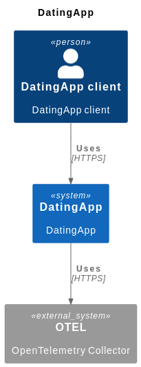
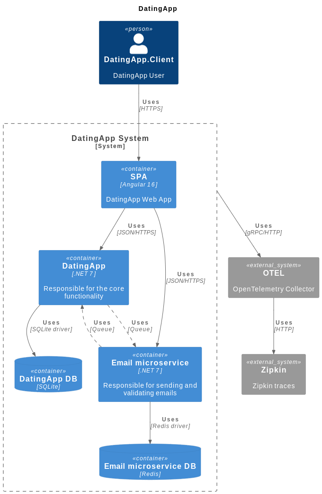

# Context

This repo was created to be pinned in my main profile (@RafaelJCamara).

The contents of this file will be the same as the README for the organization.

# Project intro

This project represents a dating app that had its based built in this [course](https://www.udemy.com/course/build-an-app-with-aspnet-core-and-angular-from-scratch/).

Since the course ended, I've been adding extra functionality in this base app.

# Repositories

## DatingApp.Client

Represents the client frontend of our Dating App. The frontend is built with Angular and Typescript.

## DatingApp

A dating app that contains functionality like messaging a user and liking users. Built with .NET 7.

## DatingApp.Email

Email microservice that supports the operations of the monolith DatingApp. Built with .NET 7.

## DatingApp.Common

NuGet package that supports the DatingApp common configurations. Built with .NET 7.

## DatingApp.Infra

Defines the infra/compute resources our DatingApp ecosystem uses. Example of resources are database, message brokers and telemetry collectors.

Contains _.yml_ files to define such resources.

# Architecture

This is the high level overview of the system:

This is a lower level overview of the system:

